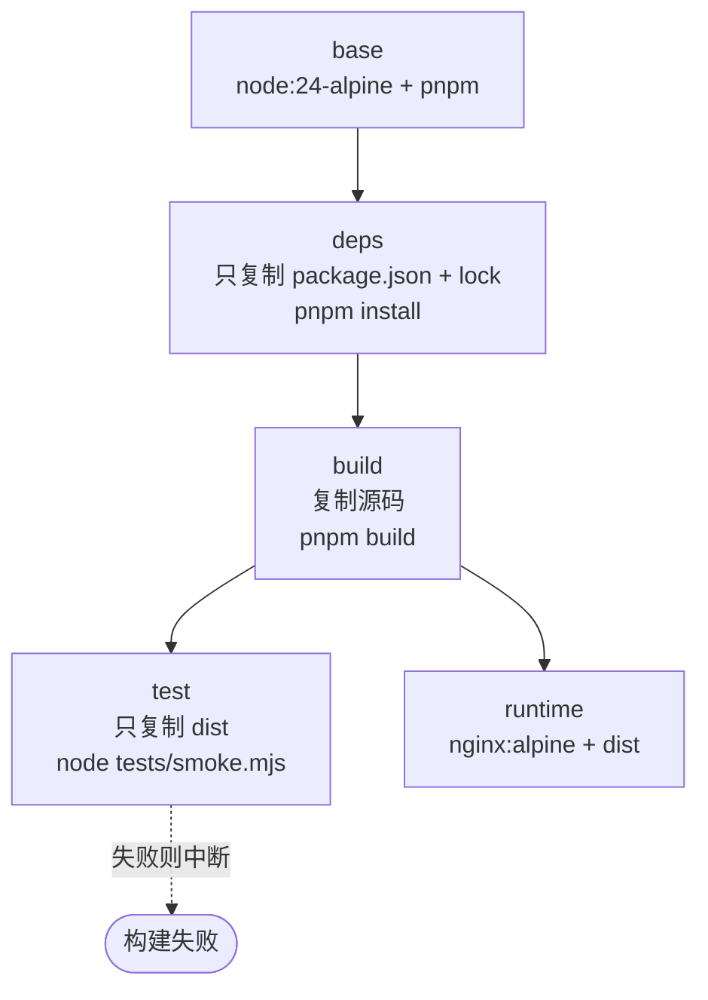

# 3.2 Docker 构建与测试

模板自带一套可直接用于生产的容器方案：**多阶段构建 + Nginx 托管 + 独立测试阶段**。

## 一分钟上手

```bash
# 构建镜像
docker build -t docs-site:latest .

# 启动（映射到本机 8080）
docker run --rm -p 8080:80 docs-site:latest

# 或者用 compose
docker compose up -d --build
```

打开 <http://localhost:8080> 即可。

想一次性跑完「构建 → 测试 → 起容器 → HTTP 校验」：

```bash
pnpm run docker:verify
# 等价于 bash scripts/docker-verify.sh
```

## 阶段划分



| 阶段 | 基础镜像 | 作用 | 是否进入最终镜像 |
| --- | --- | --- | --- |
| `base` | `node:24-alpine` | 安装 pnpm，统一环境变量 | 否 |
| `deps` | 继承 `base` | 只装依赖，最大化缓存命中 | 否 |
| `build` | 继承 `deps` | 执行 `pnpm build` | 否 |
| `test` | 继承 `base` | 对产物跑冒烟测试 | 否 |
| `runtime` | `nginx:1.27-alpine` | 托管静态产物 | **是** |

最终镜像里**没有 Node、没有源码、没有 node_modules**，只有一个 Nginx 加几十个静态文件。

::: tip 单独跑测试阶段
`test` 阶段不依赖本地环境，只依赖 `dist`：

```bash
docker build --target test -t docs:test .
```
:::

## Dockerfile 逐段说明

### 依赖层缓存

```dockerfile
FROM base AS deps
COPY package.json pnpm-lock.yaml ./
RUN --mount=type=cache,id=pnpm-store,target=/pnpm/store \
    pnpm install --frozen-lockfile --prod=false
```

两个要点：

- **只复制依赖清单**。只要 `package.json` / `pnpm-lock.yaml` 没变，改 Markdown 不会让这一层缓存失效，构建从几分钟降到几秒。
- **`--mount=type=cache`** 把 pnpm store 挂成构建缓存，跨次构建复用已下载的包。
- **`--prod=false`** 显式安装 devDependencies。VitePress 本身是 devDependency，漏了就构建不出来。

### 构建层

```dockerfile
FROM deps AS build
COPY . .
RUN pnpm run build \
 && test -f docs/.vitepress/dist/index.html
```

最后那个 `test -f` 是兜底：万一 VitePress 因为配置问题「成功但没产出」，这里会立刻失败，而不是等到运行阶段才发现。

### 测试层

```dockerfile
FROM base AS test
WORKDIR /app
COPY --from=build /app/docs/.vitepress/dist ./docs/.vitepress/dist
COPY tests ./tests
COPY package.json ./
RUN node tests/smoke.mjs
```

注意这里**只复制了 `dist` 和 `tests`**，没有源码、没有 `node_modules`。这样做有两个好处：

1. 测试对象非常明确，就是构建产物；
2. `smoke.mjs` 只用 Node 内置模块，不需要安装任何东西。

### 运行层

```dockerfile
FROM nginx:1.27-alpine AS runtime
COPY docker/security-headers.conf /etc/nginx/snippets/security-headers.conf
COPY docker/nginx.conf /etc/nginx/conf.d/default.conf
COPY --from=build --chown=nginx:nginx /app/docs/.vitepress/dist /usr/share/nginx/html
RUN chown -R nginx:nginx /usr/share/nginx/html && nginx -t
HEALTHCHECK --interval=30s --timeout=3s --start-period=5s --retries=3 \
  CMD wget -q --spider http://127.0.0.1/ || exit 1
```

`nginx -t` 在**构建时**校验配置语法，避免因为配置写错导致容器起不来。

## Nginx 配置要点

完整配置见 `docker/nginx.conf`，核心是四条：

```nginx
# 1. 路由回退：/guide/、/guide、/guide.html 都能命中
location / {
    try_files $uri $uri/ $uri.html =404;
}

# 2. 带 hash 的资源永久缓存
#    ^~ 表示命中前缀后不再尝试正则 location
location ^~ /assets/ {
    include /etc/nginx/snippets/security-headers.conf;
    add_header Cache-Control "public, max-age=31536000, immutable";
}

# 3. HTML 不缓存，保证发版立即生效
location ~* \.html$ {
    include /etc/nginx/snippets/security-headers.conf;
    add_header Cache-Control "no-cache";
}

# 4. 自定义 404 页面
error_page 404 /404.html;
```

::: warning HTML 千万别长缓存
如果 HTML 被 CDN 或浏览器缓存住，用户会在发版后长时间看到旧页面，而且因为资源文件名带 hash，新旧混用还可能直接白屏。
:::

### 为什么要单独一个 `security-headers.conf`

nginx 的 `add_header` 有个反直觉的规则：**只有当当前层级完全没有 `add_header` 时，才会继承上层的**。

也就是说，只要在某个 `location` 里写了一行 `add_header Cache-Control ...`，`server` 级别的那几个安全响应头在这个 `location` 里就**全部失效**了。缓存策略和安全头恰好都靠 `add_header` 实现，很容易踩。

所以把安全头抽成 `/etc/nginx/snippets/security-headers.conf`，凡是自己写了 `add_header` 的 `location` 都 `include` 一次。`scripts/docker-verify.sh` 会分别在静态资源和 HTML 上校验这些头确实还在。

## 冒烟测试做了什么

`tests/smoke.mjs` 直接读 `dist` 里的 HTML，覆盖六个方面：

| 分组 | 检查内容 |
| --- | --- |
| 页面完整性 | 22 个预期页面是否都生成、`sitemap.xml` 是否有效 |
| 目录自动编号 | 侧边栏是否出现 `1.` ~ `4.` 和 `1.1` ~ `1.4` |
| 渲染能力 | 首页 Hero、代码高亮、Mermaid 占位、公式、提示块、搜索索引 |
| 编译残留 | HTML 里是否还有 `{{ }}` 或没解析的 `<Mermaid>` 标签 |
| 链接完整性 | 遍历所有 HTML 的 `href` / `src`，确认站内链接都有对应文件 |
| 静态资源 | logo / favicon 是否拷贝到位，Mermaid 是否被拆成独立 chunk |

本地也能跑，不需要 Docker：

```bash
pnpm build
pnpm test
```

输出示例：

```text
构建产物冒烟测试
  产物目录：/app/docs/.vitepress/dist

1. 页面完整性
  ✓ 首页与 404 页面存在 (index.html, 404.html)
  ✓ 全部 22 个预期页面都已生成 (22 个)
  ...

结果
  通过 20 项，失败 0 项

✓ 冒烟测试全部通过
```

::: tip 为什么测试要检查「Mermaid 占位」而不是「SVG」
因为图表是在浏览器端渲染的，产物 HTML 里本来就没有 `<svg>`。测试断言的是 `<figure class="gb-mermaid">` 这个占位元素存在，详见 [2.3 Mermaid 图表](/features/mermaid)。
:::

## 镜像瘦身

| 手段 | 效果 |
| --- | --- |
| 多阶段构建，运行层不含 Node | 从 ~400MB 降到 ~50MB |
| `.dockerignore` 排除 `node_modules` / `.git` / `dist` | 构建上下文从上百 MB 降到几 MB |
| 使用 alpine 基础镜像 | 进一步减小体积 |
| `--mount=type=cache` 复用 pnpm store | 只影响构建速度，不影响体积 |

查看镜像大小：

```bash
docker images vitepress-gitbook-template
```

## 可覆盖的构建参数

`Dockerfile` 顶部的三个 ARG 都可以在构建时替换：

```bash
docker build \
  --build-arg NODE_IMAGE=node:24-alpine \
  --build-arg NGINX_IMAGE=nginx:1.27-alpine \
  --build-arg PNPM_VERSION=12.9.1 \
  -t docs-site:latest .
```

::: tip 版本要保持一致
`.nvmrc`、`Dockerfile` 的 `NODE_IMAGE`、`.github/workflows/ci.yml` 的 `NODE_VERSION` 三处应当指向同一个 Node 大版本，否则「本地能构建、CI 挂了」这类问题会很难查。
:::

::: danger 换 pnpm 版本要同步更新锁文件
`pnpm-lock.yaml` 的 `lockfileVersion` 和 pnpm 大版本绑定。如果构建时用了不同大版本的 pnpm，`--frozen-lockfile` 会直接失败。换版本后请在本地重新执行一次 `pnpm install` 并提交锁文件。
:::

## 常见问题

::: details 构建时报错 `ERR_PNPM_OUTDATED_LOCKFILE`
锁文件和 `package.json` 不一致。在本地执行 `pnpm install` 更新锁文件并提交。
:::

::: details 构建很慢，每次都要重新下载依赖
说明 `deps` 层缓存没命中。检查是不是每次都在改 `package.json`，或者构建时加了 `--no-cache`。
:::

::: details 容器起来了但页面 404
先看 Nginx 是否把 `dist` 挂对了：

```bash
docker run --rm -it docs-site:latest sh -c 'ls /usr/share/nginx/html'
```

再确认 `try_files` 配置没有被覆盖。
:::

::: details 想改用 80 以外的端口
容器内部固定监听 80，映射到宿主机时改端口即可：

```bash
docker run --rm -p 9000:80 docs-site:latest
```
:::

## 下一步

- [3.3 部署到静态托管](/deploy/hosting)
- [4. 配置参考](/reference/)
