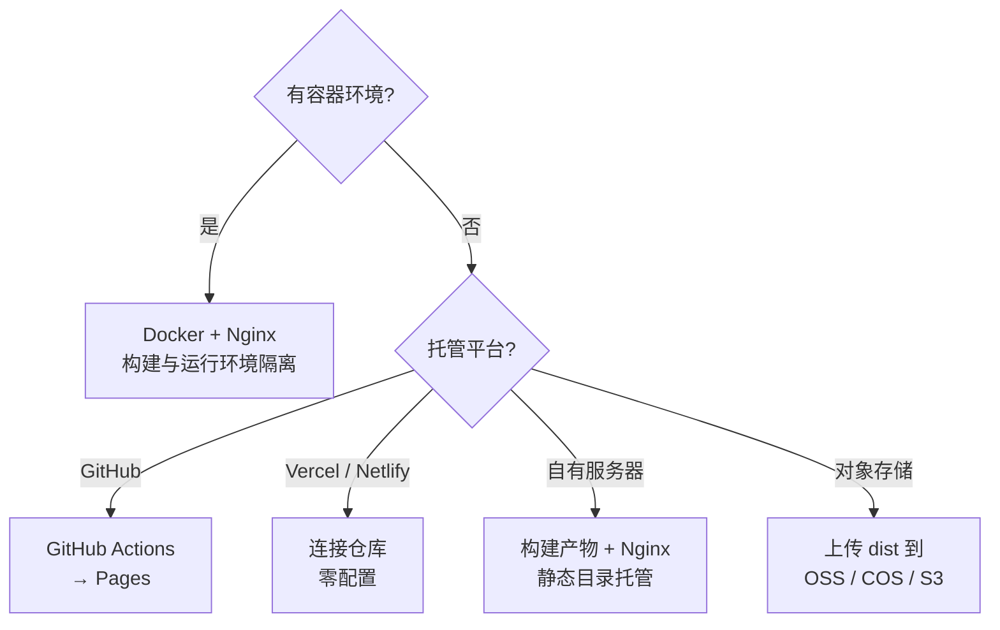

# 3. 部署指南

模板的产物是一堆纯静态文件（`docs/.vitepress/dist`），所以部署方式非常自由。这一章覆盖三种主流做法。

## 3.1 本章内容

<CardGrid>
  <Card icon="⚙️" title="本地构建与预览" href="/deploy/build" desc="构建流程、产物结构、常见构建报错与排查方法。" />
  <Card icon="🐳" title="Docker 构建与测试" href="/deploy/docker" desc="多阶段 Dockerfile 逐层解析，以及容器内冒烟测试。" />
  <Card icon="🌐" title="部署到静态托管" href="/deploy/hosting" desc="GitHub Pages、Vercel、Nginx、对象存储的接入方式。" />
</CardGrid>

## 3.2 三条路径怎么选



| 方式 | 适合场景 | 需要什么 | 构建在哪 |
| --- | --- | --- | --- |
| Docker + Nginx | 自有服务器、内网、需要环境一致 | Docker | 容器内 |
| GitHub Pages | 开源项目文档 | 一个仓库 | GitHub Actions |
| Vercel / Netlify | 想要零配置 + 预览环境 | 平台账号 | 平台 |
| 对象存储 + CDN | 已有云资源、追求访问速度 | 云账号 | 本地或 CI |

## 3.3 构建产物长什么样

`pnpm build` 之后，`docs/.vitepress/dist` 的结构大致是：

```text
dist/
├── index.html                    # 首页
├── guide/
│   ├── index.html                # /guide/
│   ├── introduction.html         # /guide/introduction
│   └── ...
├── assets/
│   ├── style.[hash].css
│   ├── chunks/
│   │   ├── theme.[hash].js
│   │   ├── Mermaid.[hash].js     # 懒加载的图表 chunk
│   │   └── ...
│   └── ...
├── logo.svg                      # 来自 docs/public
├── favicon.svg
├── sitemap.xml
└── 404.html
```

::: tip 产物是纯静态的
不需要 Node 运行时，也不需要任何后端。任意静态服务器（包括 `python -m http.server`）都能托管。
:::

## 3.4 部署前检查清单

- [ ] 修改 `config.mts` 里的 `SITE.url` 为真实域名（影响 sitemap 与 og 标签）
- [ ] 修改 `SITE.repo` 为真实仓库地址（影响「编辑此页」链接）
- [ ] 如果部署在子路径（如 `/docs/`），把 `base` 改成对应的值
- [ ] 执行 `pnpm build && pnpm test` 确认产物正常
- [ ] 检查 `404.html` 是否被托管平台正确使用

## 下一步

从 [3.1 本地构建与预览](/deploy/build) 开始。
