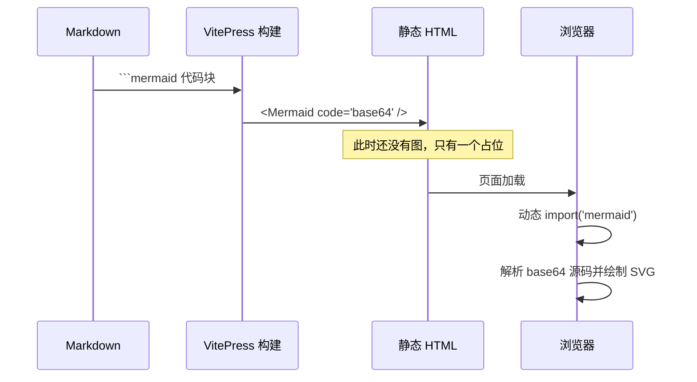

# 2. 功能特性

这一章介绍模板已经接好线的能力。每一项都配有可以直接复制走的最小示例。

## 2.1 本章内容

<CardGrid>
  <Card icon="📝" title="Markdown 扩展语法" href="/features/markdown" desc="提示块、代码组、徽章、折叠面板等 VitePress 扩展语法。" />
  <Card icon="💻" title="代码高亮" href="/features/code" desc="行高亮、行号、diff、代码组，以及更换 Shiki 主题。" />
  <Card icon="📊" title="Mermaid 图表" href="/features/mermaid" desc="流程图、时序图、状态图、甘特图，全部用文本描述。" />
  <Card icon="🧮" title="数学公式" href="/features/math" desc="行内与块级公式，构建期渲染，不依赖客户端字体。" />
  <Card icon="🧩" title="组件与主题定制" href="/features/customize" desc="内置 Card 组件、如何加自己的组件、如何换配色。" />
</CardGrid>

## 2.2 能力总览

| 能力 | 语法入口 | 渲染时机 | 依赖 |
| --- | --- | --- | --- |
| 提示块 | `::: tip` / `warning` / `danger` | 构建期 | 无（VitePress 内置） |
| 代码组 | `::: code-group` | 构建期 | 无 |
| 代码高亮 | ` ```ts ` | 构建期（Shiki） | 无 |
| Mermaid | ` ```mermaid ` | **浏览器端**（懒加载） | `mermaid` |
| 数学公式 | `$...$` / `$$...$$` | 构建期（MathJax） | `markdown-it-mathjax3` |
| 卡片 | `<Card>` / `<CardGrid>` | 构建期 + 客户端水合 | 模板自带组件 |
| 本地搜索 | 顶部搜索框 | 浏览器端 | MiniSearch（内置） |

## 2.3 关于「构建期」和「浏览器端」

理解这两者的区别，能帮你判断某个功能为什么「构建产物里看不到」：



所以：**Mermaid 图表在 `pnpm build` 的产物 HTML 里看不到 `<svg>`，这是正常的**。冒烟测试里对应的断言是「存在 Mermaid 占位组件」，而不是「存在 SVG」。

其余功能（代码高亮、公式、提示块）都在构建期完成，产物 HTML 里就能看到最终结果。

## 下一步

从 [2.1 Markdown 扩展语法](/features/markdown) 开始逐个了解。
