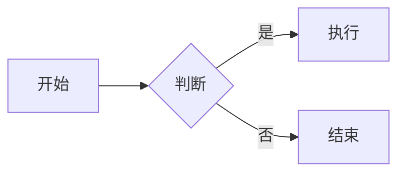
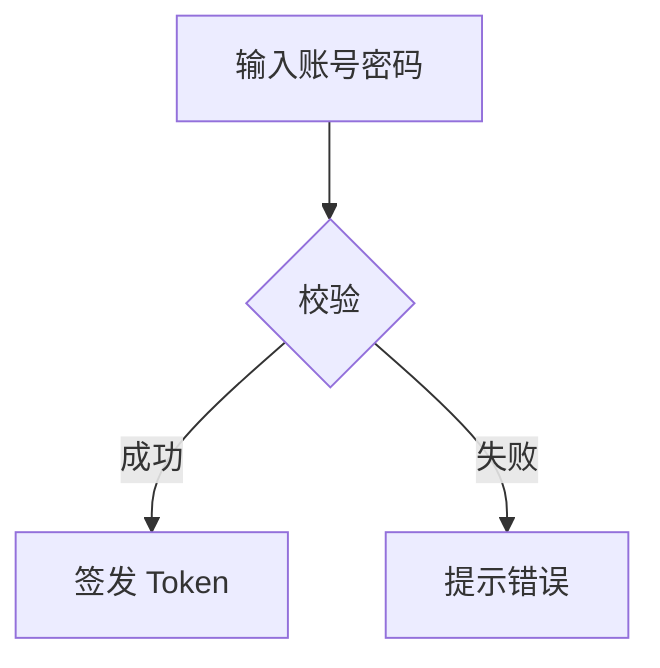
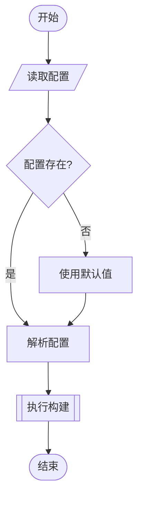
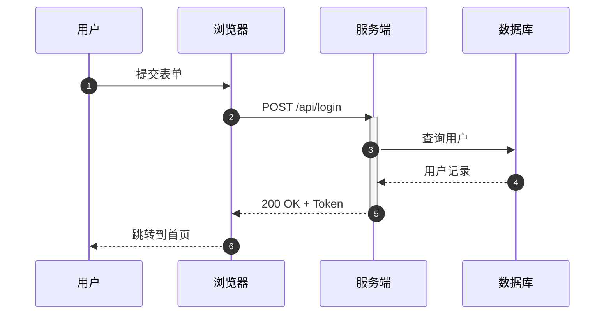
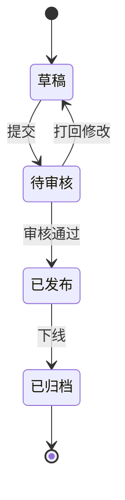
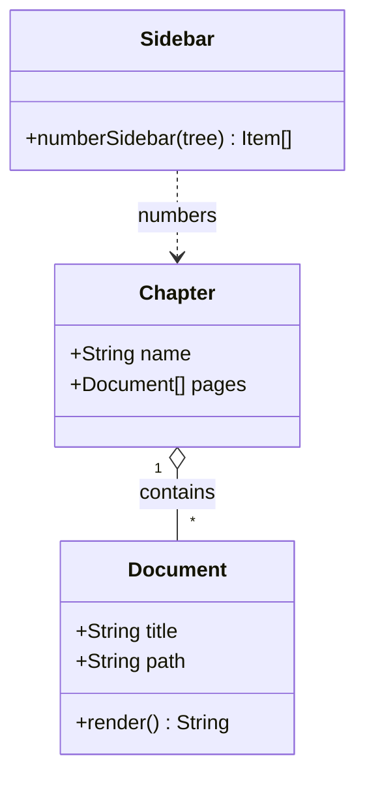
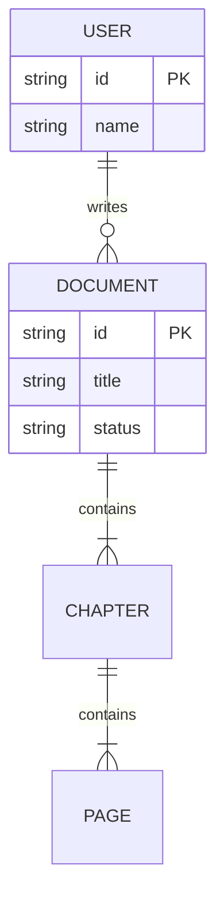
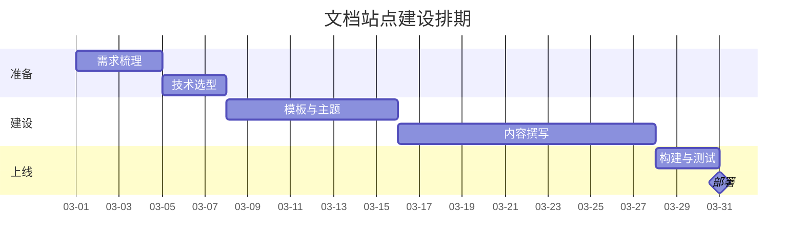
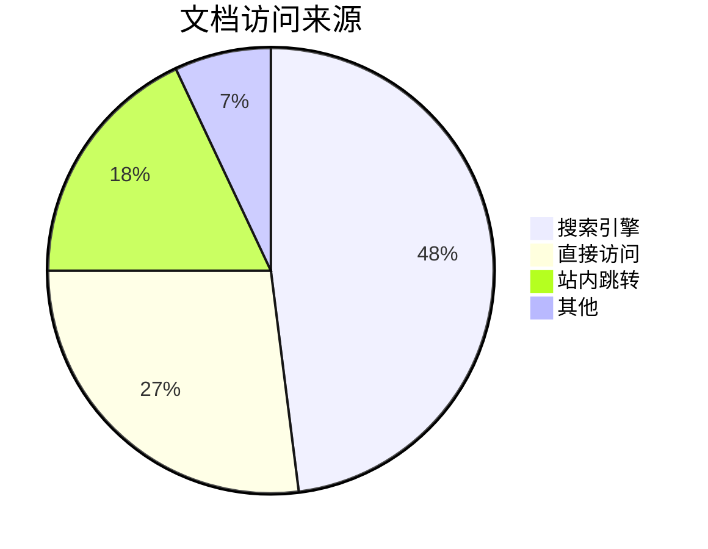

# 2.3 Mermaid 图表

[Mermaid](https://mermaid.js.org/) 让你用**文本**画图。好处很直接：图表能进 Git、能 review、能 diff，改一个节点不用重新导出图片。

## 基础用法

用 ` ```mermaid ` 代码块即可，模板会自动把它变成一个图表：

````markdown

````


## 加标题

在 `mermaid` 后面写文字，会作为图表上方的说明：

````markdown

````


## 流程图

支持四种方向：`TD`（上到下）、`BT`、`LR`（左到右）、`RL`。



节点形状速查：

| 写法 | 形状 |
| --- | --- |
| `A[文本]` | 矩形 |
| `A(文本)` | 圆角矩形 |
| `A([文本])` | 胶囊形 |
| `A[[文本]]` | 子程序框 |
| `A{文本}` | 菱形（判断） |
| `A[/文本/]` | 平行四边形 |
| `A((文本))` | 圆形 |

## 时序图



## 状态图



## 类图



## ER 图



## 甘特图



## 饼图



## 渲染原理

模板对 Mermaid 的处理方式和其他插件不太一样，值得了解：

```mermaid
flowchart LR
  A["```mermaid 代码块"] --> B["markdown-it 插件<br/>plugins/mermaid.mts"]
  B --> C["&lt;Mermaid code='base64' /&gt;"]
  C --> D["构建产物<br/>只有占位符"]
  D --> E["浏览器端<br/>动态 import('mermaid')"]
  E --> F["绘制 SVG"]
```

三个关键设计：

1. **源码用 base64 编码后放进组件属性**。Mermaid 语法里大量出现 `"`、`<`、`>`、`&`，直接写进 HTML 属性会破坏模板编译；base64 只含 `A-Za-z0-9+/=`，天然安全。
2. **渲染发生在浏览器端**。构建时不需要 headless 浏览器，构建速度和稳定性都不受影响。
3. **`mermaid` 是懒加载的独立 chunk**。页面里没有图表就不会下载它，首屏不受影响。

::: warning 别在构建产物里找 SVG
`pnpm build` 生成的 HTML 里，图表位置只有 `<Mermaid code="...">` 占位，没有 `<svg>`。这是预期行为，不是构建失败。
:::

## 自定义渲染参数

图表的外观参数在 `docs/.vitepress/theme/components/Mermaid.vue` 里：

```ts
mermaid.initialize({
  startOnLoad: false,
  securityLevel: 'loose',                      // 允许标签里写 HTML
  theme: isDark.value ? 'dark' : 'default',    // 跟随明暗模式
  fontFamily: 'inherit',                       // 使用站点字体
  flowchart: { useMaxWidth: true, htmlLabels: true }
})
```

### 换成其他内置主题

把 `theme` 换成 Mermaid 自带的主题名即可：

| 主题 | 观感 |
| --- | --- |
| `default` | 默认，配色柔和 |
| `neutral` | 黑白灰，适合打印 |
| `dark` | 深色 |
| `forest` | 绿色系 |
| `base` | 无样式底座，配合 `themeVariables` 完全自定义 |

### 用主题变量对齐站点主色

```ts
mermaid.initialize({
  theme: 'base',
  themeVariables: {
    primaryColor: '#e8efff',
    primaryBorderColor: '#2f5fe0',
    primaryTextColor: '#1f2430',
    lineColor: '#5b6b8c'
  }
})
```

::: tip 深色模式要重绘
组件里已经 `watch(isDark)` 并在切换时重新渲染，所以不需要你在 Markdown 里做任何额外处理。
:::

## 语法报错怎么办

图表渲染失败时，组件会把原始错误信息显示在页面相应位置，并标红边框。常见原因：

::: details Parse error：多半是中文或特殊字符没加引号
节点文字里包含空格、括号、冒号等符号时，用引号包起来：

```text
A[这是一个 带空格 的节点]     ✗
A["这是一个 带空格 的节点"]   ✓
```
:::

::: details 用了 Mermaid 不支持的方向关键字
`flowchart` 只支持 `TD` / `TB` / `BT` / `LR` / `RL`。写成 `flowchart XY` 会直接报错。
:::

::: details 缩进混乱
Mermaid 对缩进不敏感，但对**换行**敏感。`sequenceDiagram` 里的 `participant` 声明必须在消息之前。
:::

## 下一步

- [2.4 数学公式](/features/math)
- [2.5 组件与主题定制](/features/customize)
