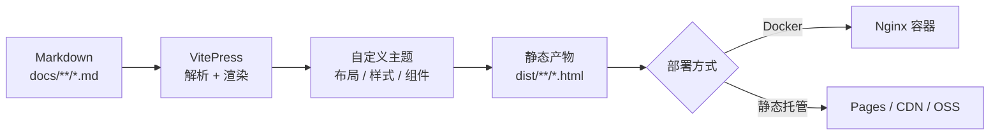

# 1.1 模板简介

## 它是什么

这是一个**文档站点模板**，不是一个应用框架。它的目标是：把「写文档」这件事变得足够省事，同时保留随时改造的自由度。

产出的东西是一堆纯静态 HTML/CSS/JS，可以直接丢到 Nginx、GitHub Pages、Vercel、对象存储，甚至直接双击打开。

## 技术选型

| 层面 | 选型 | 为什么 |
| --- | --- | --- |
| 静态站点生成 | [VitePress](https://vitepress.dev/) 1.x | 基于 Vite，开发时热更新极快；默认主题成熟，且容易继承覆盖 |
| 构建工具 | Vite 5 | VitePress 内置，无需额外配置 |
| 内容格式 | Markdown + Vue 组件 | 纯 Markdown 写正文，需要交互时再引入 Vue 组件 |
| 代码高亮 | Shiki（VitePress 内置） | 构建期高亮，和 VS Code 同一套语法，双主题跟随明暗模式 |
| 图表 | Mermaid 12 | 用文本描述流程图 / 时序图 / 状态图，版本可 review |
| 公式 | MathJax 3 | 构建期渲染，产物不依赖客户端字体 |
| 搜索 | MiniSearch（VitePress 内置） | 纯前端本地搜索，不需要 Algolia 账号 |
| 部署 | Docker 多阶段 + Nginx | 构建环境与运行环境隔离，运行镜像只含静态文件 |

## 整体设计

下面这张图描述了从 Markdown 到线上页面的完整链路：



## 和原生 VitePress 的差别

这个模板**没有 fork** VitePress，而是通过标准的扩展点做增量定制，所以升级 VitePress 基本不会冲突。具体新增了：

1. **自动编号的目录**：`docs/.vitepress/sidebar.ts` 里维护一份目录树，序号由 `numberSidebar()` 递归生成。
2. **GitBook 风格主题**：`docs/.vitepress/theme/` 下用 `extends: DefaultTheme` 继承默认主题，只覆盖样式与个别组件。
3. **Mermaid 插件**：一个 40 行左右的 markdown-it 插件，把 ` ```mermaid ` 代码块编译成懒加载的 Vue 组件。
4. **自定义组件**：`<Card>` / `<CardGrid>` 用于首页和章节导览。
5. **Docker 工具链**：多阶段 Dockerfile，含独立的 `test` 阶段和 Nginx 运行时。

## 什么时候不适合用它

- 需要多语言站点：模板已经设置 `lang: 'zh-CN'`，多语言要走 VitePress 的 locales 机制，需要自己扩展。
- 需要版本化文档（v1/v2 并存）：需要接入 `vitepress-plugin-versions` 之类的方案。
- 需要服务端渲染的动态内容：静态站点生成器不适合这类场景。

## 接下来

- [1.2 环境要求与安装](/guide/installation)
- [1.3 目录结构说明](/guide/structure)
