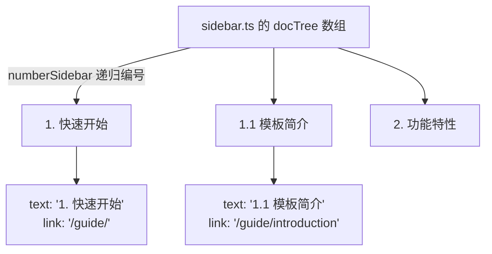

# 1.3 目录结构说明

## 完整目录树

```text
vitepress-gitbook-template/
├── docs/                              # 站点根目录（VitePress 的 srcDir）
│   ├── .vitepress/
│   │   ├── config.mts                 # ★ 站点总配置：标题、导航、搜索、Markdown 选项
│   │   ├── sidebar.ts                # ★ 目录树 + 自动编号逻辑
│   │   ├── plugins/
│   │   │   └── mermaid.ts            # Mermaid 的 markdown-it 插件
│   │   └── theme/
│   │       ├── index.ts               # ★ 主题入口：继承默认主题、注册全局组件
│   │       ├── components/
│   │       │   ├── Mermaid.vue        # 图表渲染组件
│   │       │   ├── Card.vue           # 卡片
│   │       │   └── CardGrid.vue       # 卡片网格
│   │       └── styles/
│   │           ├── index.css          # 样式入口（只做 @import）
│   │           ├── vars.css           # ★ 设计变量：配色、字体、圆角
│   │           ├── base.css           # 全局基础与整体布局
│   │           ├── sidebar.css        # 左侧目录
│   │           ├── content.css        # 正文排版
│   │           ├── home.css           # 首页
│   │           └── components.css     # 自定义组件与提示块
│   ├── public/                        # 原样拷贝到产物根目录的静态资源
│   │   ├── logo.svg
│   │   └── favicon.svg
│   ├── index.md                       # 首页（layout: home）
│   ├── guide/                         # 章节 1：快速开始
│   │   ├── index.md                   #   章节首页 → /guide/
│   │   ├── introduction.md            #   → /guide/introduction
│   │   ├── installation.md
│   │   ├── structure.md
│   │   └── writing.md
│   ├── features/                      # 章节 2：功能特性
│   ├── deploy/                        # 章节 3：部署指南
│   └── reference/                     # 章节 4：配置参考
├── docker/
│   ├── nginx.conf                     # 运行时 Nginx 配置
│   └── security-headers.conf          # 安全响应头（多个 location 复用）
├── scripts/
│   ├── clean.mjs                      # 清理产物
│   └── docker-verify.sh               # 构建镜像 + 起容器 + HTTP 校验
├── tests/
│   └── smoke.mjs                      # 产物冒烟测试
├── Dockerfile                         # 多阶段构建（deps → build → test → runtime）
├── docker-compose.yml                 # 本地一键构建运行
├── package.json
├── tsconfig.json
└── pnpm-lock.yaml
```

## 关键文件职责

### `docs/.vitepress/config.mts`

站点总配置。里面分成四块，都用注释标出：

1. **站点基础信息**：标题、描述、语言、仓库地址、sitemap 域名。
2. **Markdown 渲染**：Shiki 主题、行号、数学公式、以及 `md.use(mermaidPlugin)`。
3. **主题配置**：顶部导航、侧边栏、右侧大纲、本地搜索、编辑链接、页脚。
4. **构建选项**：Vite 层面的配置。

### `docs/.vitepress/sidebar.ts`

**整站目录的唯一来源**。你在 `docTree` 数组里的书写顺序，直接决定目录里的 `1.` / `1.1` 编号。详细用法见 [4.2 目录与自动编号](/reference/sidebar)。

### `docs/.vitepress/theme/`

主题采用「继承 + 覆盖」：

```ts
export default {
  extends: DefaultTheme,        // 先继承 VitePress 默认主题
  enhanceApp({ app }) {         // 再注册自己的全局组件
    app.component('Mermaid', Mermaid)
  }
}
```

样式按关注点拆成 7 个文件，`index.css` 只负责按顺序 `@import`。**加载顺序就是覆盖顺序**，所以自定义规则永远写在最后。

### `docs/public/`

这里的文件会**原样**拷贝到产物根目录。例如 `docs/public/logo.svg` 对应最终 URL `/logo.svg`。

::: warning 别把图片放错地方
- `docs/public/xxx.png` → 引用时写 `/xxx.png`，文件不参与打包压缩。
- `docs/guide/xxx.png` → 引用时写 `./xxx.png`，会走 Vite 资源处理（可被压缩、加 hash）。
:::

## 「我想改 X，该动哪个文件？」

| 我想改… | 改这个文件 |
| --- | --- |
| 站点名称 / 描述 / 域名 | `docs/.vitepress/config.mts` 顶部的 `SITE` 对象 |
| 顶部导航栏 | `config.mts` 里的 `themeConfig.nav` |
| 左侧目录顺序与标题 | `docs/.vitepress/sidebar.ts` 的 `docTree` |
| 主色 / 字体 / 圆角 | `docs/.vitepress/theme/styles/vars.css` |
| 正文字号、行高、表格样式 | `styles/content.css` |
| 首页文案与卡片 | `docs/index.md` |
| 代码高亮主题 | `config.mts` 里的 `markdown.theme` |
| Mermaid 渲染参数 | `theme/components/Mermaid.vue` 的 `initialize()` |
| 新增全局组件 | `theme/components/` 下建组件，再到 `theme/index.ts` 注册 |
| 部署时的 Nginx 行为 | `docker/nginx.conf` |

## 目录编号和文件结构的关系

需要特别说明：**目录里的一级章节编号和文件夹没有强绑定关系**。编号完全由 `sidebar.ts` 的数组顺序决定。

这样做的好处是，你可以自由地重组目录顺序、把两篇文档换位置，而不需要重命名任何文件或目录。



## 下一步

了解了文件职责，接下来看 [1.4 编写与组织内容](/guide/writing)，动手加一篇文档。
